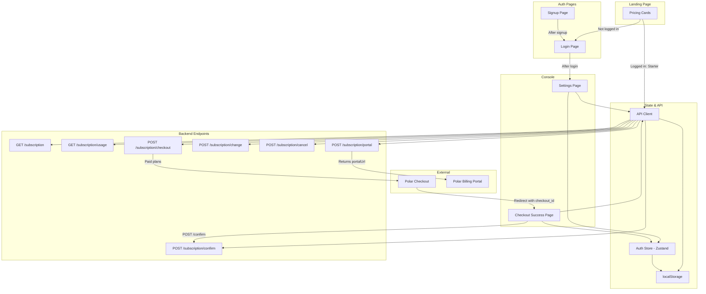
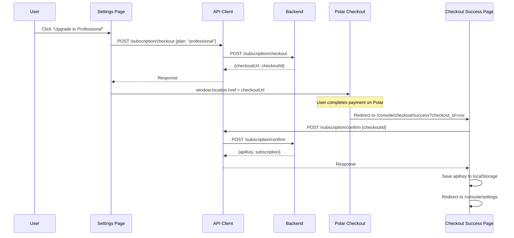
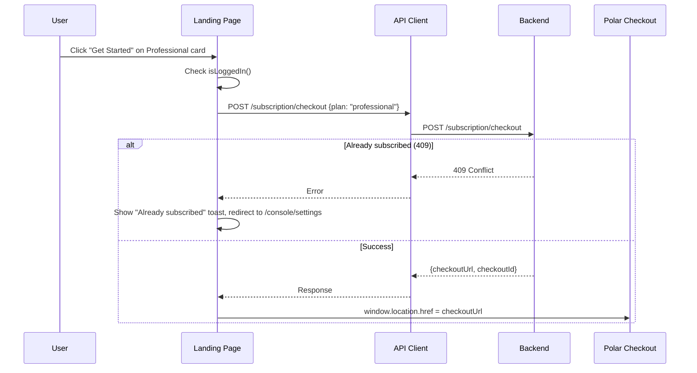
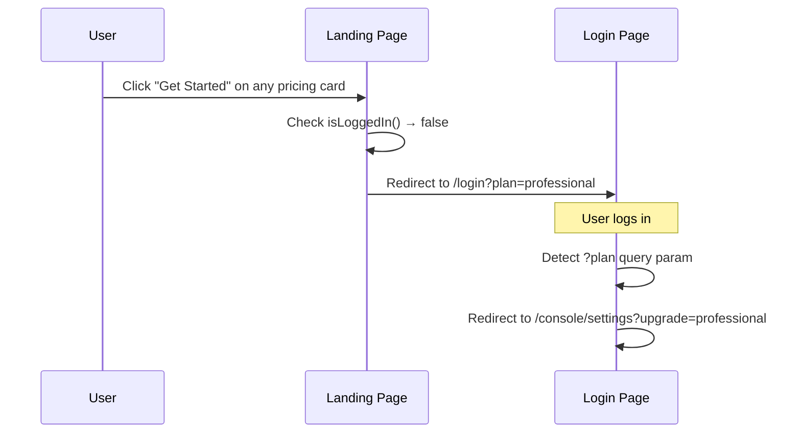
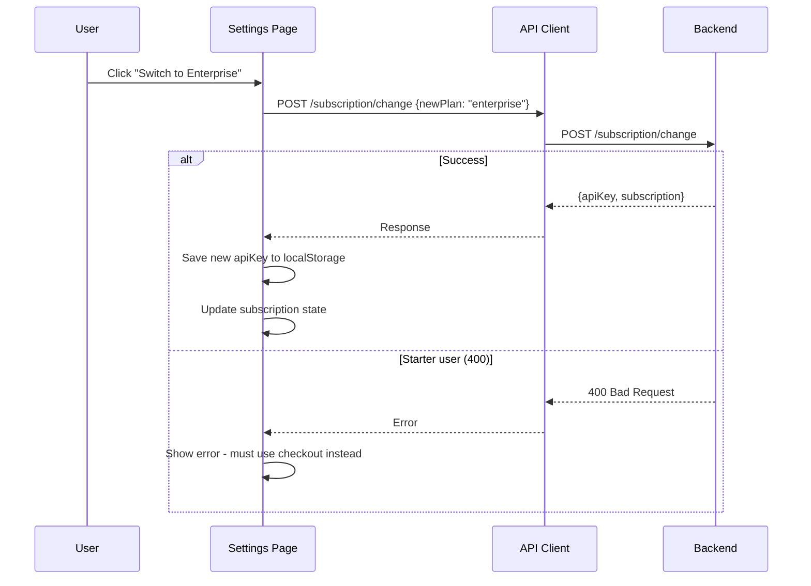

# Design Document: Payment Gateway Integration (Polar)

## Overview

This feature integrates Polar as the payment gateway into the KnowledgeDB console frontend. The integration covers the full subscription lifecycle: checkout for new subscriptions, plan changes between paid tiers, cancellation, billing portal access, and a checkout confirmation page that handles Polar's redirect flow.

The existing settings page already has partial subscription UI but contains incorrect button logic that doesn't match backend endpoint constraints (e.g., showing "Manage Billing" for Starter users, attempting plan changes via `/change` for Starter users). The landing page pricing cards currently link to a contact section instead of triggering actual checkout flows. No checkout success/confirmation page exists yet.

The design focuses on five deliverables: (1) a checkout success page, (2) corrected settings page button logic, (3) wired landing page pricing CTAs, (4) proper API key persistence after payment operations, and (5) comprehensive error handling for all subscription endpoints.

## Architecture



## Sequence Diagrams

### Starter User → Paid Plan Checkout



### Landing Page → Checkout (Logged In)



### Landing Page → Checkout (Not Logged In)



### Plan Change (Pro ↔ Enterprise)



## Components and Interfaces

### Component 1: Checkout Success Page

**Path**: `src/app/console/checkout/success/page.tsx`

**Purpose**: Handles the redirect from Polar after a successful payment. Reads the `checkout_id` query parameter, calls POST `/subscription/confirm` to finalize the subscription, saves the new API key, and redirects to settings.

```typescript
interface CheckoutSuccessState {
  status: 'confirming' | 'success' | 'error';
  errorMessage: string | null;
}
```

**Responsibilities**:
- Read `checkout_id` from URL search params on mount
- Call `POST /subscription/confirm` with the checkoutId
- Save returned `apiKey` to localStorage via `localStorage.setItem('kdb_api_key', apiKey)`
- Show a loading/confirming state while the API call is in progress
- Show success state briefly, then redirect to `/console/settings`
- Show error state if confirmation fails (invalid/expired checkout ID)
- Handle missing `checkout_id` param gracefully (redirect to settings)

### Component 2: Settings Page (Revised Button Logic)

**Path**: `src/app/console/settings/page.tsx` (existing, needs fixes)

**Purpose**: Display subscription info, usage stats, and provide plan management actions with correct button visibility per plan.

```typescript
interface SubscriptionActions {
  // Visible for Starter users only
  upgradeToProOrEnterprise: (plan: 'professional' | 'enterprise') => Promise<void>;
  // Visible for Professional/Enterprise users only
  changePlan: (newPlan: 'professional' | 'enterprise') => Promise<void>;
  // Visible for Professional/Enterprise users only
  cancelSubscription: () => Promise<void>;
  // Visible for Professional/Enterprise users only
  openBillingPortal: () => Promise<void>;
}
```

**Button Visibility Rules**:

| Current Plan   | Upgrade Buttons                          | Change Button                  | Cancel Button | Manage Billing |
|----------------|------------------------------------------|--------------------------------|---------------|----------------|
| starter        | "Upgrade to Pro" + "Upgrade to Enterprise" | Hidden                         | Hidden        | Hidden         |
| professional   | Hidden                                   | "Switch to Enterprise"         | Show          | Show           |
| enterprise     | Hidden                                   | "Switch to Professional"       | Show          | Show           |

**Responsibilities**:
- Fetch subscription and usage data on mount
- Render buttons conditionally based on current plan
- Handle `POST /subscription/checkout` for Starter → Paid upgrades (redirect to Polar)
- Handle `POST /subscription/change` for Pro ↔ Enterprise switches (save new apiKey)
- Handle `POST /subscription/cancel` with confirmation dialog
- Handle `POST /subscription/portal` to open Polar billing portal
- Display error toasts for 409 (already subscribed), 400 (invalid change), 404/500 (starter can't cancel/portal)
- Handle `?upgrade=plan` query param (auto-trigger checkout after login redirect from landing page)

### Component 3: Landing Page Pricing CTAs (Revised)

**Path**: `src/app/page.tsx` (existing, needs wiring)

**Purpose**: Connect pricing card buttons to actual checkout flows instead of scrolling to contact section.

```typescript
interface PricingCTABehavior {
  starter: {
    loggedIn: () => void;    // POST /checkout {plan: "starter"} → save apiKey directly
    notLoggedIn: () => void; // Redirect to /signup
  };
  professional: {
    loggedIn: () => void;    // POST /checkout {plan: "professional"} → redirect to Polar
    notLoggedIn: () => void; // Redirect to /login?plan=professional
  };
  enterprise: {
    loggedIn: () => void;    // POST /checkout {plan: "enterprise"} → redirect to Polar
    notLoggedIn: () => void; // Redirect to /login?plan=enterprise
  };
}
```

**Responsibilities**:
- Check auth state to determine if user is logged in
- For logged-in users: call `POST /subscription/checkout` directly
- For not-logged-in users: redirect to `/login?plan={plan}` (or `/signup` for Starter)
- Handle Starter plan instant activation (no Polar redirect needed)
- Handle 409 conflict (already subscribed) with user-friendly message
- Show loading state on the clicked button during API call

### Component 4: Login Page (Enhanced)

**Path**: `src/app/login/page.tsx` (existing, minor enhancement)

**Purpose**: After successful login, detect `?plan` query parameter and redirect to settings with upgrade intent.

**Responsibilities**:
- Read `?plan` query param from URL
- After successful login, if `?plan` exists, redirect to `/console/settings?upgrade={plan}` instead of `/console`
- No changes to existing login logic otherwise

## Data Models

### Subscription

```typescript
interface Subscription {
  plan: 'starter' | 'professional' | 'enterprise';
  status: 'active' | 'canceled' | 'past_due';
  apiKey: string;
  currentPeriodStart: string;  // ISO 8601
  currentPeriodEnd: string;    // ISO 8601
  createdAt: string;
  updatedAt: string;
}
```

### Usage

```typescript
interface Usage {
  plan: string;
  quota: number;
  used: number;
  remaining: number;
  percentUsed: number;       // 0-100
  periodStart: string;
  periodEnd: string;
  throttle: {
    rateLimit: number;       // requests per second
    burstLimit: number;
  };
}
```

### Checkout Response

```typescript
// For Starter plan (instant activation)
interface CheckoutResponseFree {
  apiKey: string;
  subscription: Subscription;
}

// For Professional/Enterprise (Polar redirect)
interface CheckoutResponsePaid {
  checkoutUrl: string;
  checkoutId: string;
}

type CheckoutResponse = CheckoutResponseFree | CheckoutResponsePaid;
```

### Confirm Response

```typescript
interface ConfirmResponse {
  apiKey: string;
  subscription: Subscription;
}
```

### Change Response

```typescript
interface ChangeResponse {
  apiKey: string;
  subscription: Subscription;
}
```

### Portal Response

```typescript
interface PortalResponse {
  portalUrl: string;
}
```

**Validation Rules**:
- `plan` must be one of: `'starter'`, `'professional'`, `'enterprise'`
- `checkoutId` must be a non-empty string when calling `/confirm`
- `newPlan` for `/change` must differ from current plan and cannot be `'starter'`
- API key must be persisted to `localStorage` under key `kdb_api_key` after any operation that returns one


## Error Handling

### Error Scenario 1: Already Subscribed (409 Conflict)

**Condition**: User calls `POST /subscription/checkout` but already has an active paid subscription.
**Response**: Display inline error message: "You already have an active subscription. Use plan switching to change plans."
**Recovery**: Guide user to the settings page where they can use the "Switch to..." button instead.

### Error Scenario 2: Starter Cannot Use /change (400 Bad Request)

**Condition**: A Starter user somehow triggers `POST /subscription/change` (should not happen with correct button logic, but defensive handling).
**Response**: Display error: "Free plan users must upgrade through checkout. Please use the Upgrade button."
**Recovery**: UI already hides the change button for Starter users. This is a safety net.

### Error Scenario 3: Starter Cannot Cancel (404)

**Condition**: A Starter user triggers `POST /subscription/cancel`.
**Response**: Display error: "Free plans cannot be canceled."
**Recovery**: UI hides cancel button for Starter users. Safety net only.

### Error Scenario 4: Starter Cannot Access Portal (500)

**Condition**: A Starter user triggers `POST /subscription/portal`.
**Response**: Display error: "Billing portal is only available for paid plans."
**Recovery**: UI hides Manage Billing button for Starter users. Safety net only.

### Error Scenario 5: Invalid/Expired Checkout ID on Confirm

**Condition**: User arrives at checkout success page with an invalid or expired `checkout_id`.
**Response**: Display error page: "We couldn't confirm your payment. The checkout session may have expired."
**Recovery**: Provide a "Go to Settings" link so the user can check their subscription status or retry.

### Error Scenario 6: Missing checkout_id Parameter

**Condition**: User navigates to `/console/checkout/success` without a `checkout_id` query parameter.
**Response**: Redirect immediately to `/console/settings`.
**Recovery**: Automatic redirect, no user action needed.

### Error Scenario 7: Network Error During Checkout/Confirm

**Condition**: Network failure during any subscription API call.
**Response**: Display generic error: "Something went wrong. Please check your connection and try again."
**Recovery**: User can retry the action. For confirm, they can revisit the success URL or check settings.

### Error Scenario 8: 401 Unauthorized (Token Expired)

**Condition**: Auth token expires during a subscription operation.
**Response**: The existing `apiRequest` function handles 401 by auto-refreshing the token and retrying once.
**Recovery**: If refresh also fails, user is redirected to login. The `?plan` param flow ensures they can resume checkout after re-login.

## Testing Strategy

### Unit Testing Approach

- Test button visibility logic: given a plan, verify which buttons render
- Test checkout flow branching: Starter (instant) vs. paid (redirect)
- Test `checkout_id` extraction from URL search params
- Test API key persistence after checkout/confirm/change operations
- Test error state rendering for each error scenario
- Test landing page CTA behavior for logged-in vs. not-logged-in states

### Property-Based Testing Approach

**Property Test Library**: fast-check

- For any valid plan value, the correct set of buttons is rendered
- For any subscription state, the API key in localStorage matches the most recent operation's returned key
- For any combination of auth state and plan selection on the landing page, the correct redirect/action occurs

### Integration Testing Approach

- Full checkout flow: click upgrade → mock Polar redirect → success page → confirm → verify apiKey saved
- Plan change flow: Pro user switches to Enterprise → verify new apiKey and updated subscription state
- Landing page to checkout: not logged in → login with plan param → auto-trigger checkout
- Error recovery: simulate 409 on checkout → verify error message and no redirect

## Correctness Properties

*A property is a characteristic or behavior that should hold true across all valid executions of a system — essentially, a formal statement about what the system should do. Properties serve as the bridge between human-readable specifications and machine-verifiable correctness guarantees.*

### Property 1: Button visibility is determined by plan

*For any* valid plan value (starter, professional, enterprise), the Settings_Page renders exactly the correct set of action buttons: Starter shows only upgrade buttons; Professional shows "Switch to Enterprise", "Cancel", and "Manage Billing"; Enterprise shows "Switch to Professional", "Cancel", and "Manage Billing". No plan shows buttons belonging to another plan's action set.

**Validates: Requirements 2.1, 2.2, 2.3, 2.4, 2.5, 2.6**

### Property 2: API key persistence round-trip

*For any* subscription operation (checkout, confirm, change) that returns an API_Key, saving it to localStorage and then reading `kdb_api_key` from localStorage produces the same key value. This holds regardless of which endpoint returned the key.

**Validates: Requirements 7.1, 1.2, 3.3, 3.5**

### Property 3: Checkout confirm is called with the correct checkout_id

*For any* non-empty checkout_id string present in the URL query parameters, the Checkout_Success_Page calls POST `/subscription/confirm` with that exact checkout_id value.

**Validates: Requirement 1.1**

### Property 4: Landing page CTA routes correctly by auth state and plan

*For any* combination of authentication state (logged in / not logged in) and plan selection (starter, professional, enterprise), the Landing_Page pricing CTA produces the correct action: logged-in + paid plan → checkout API call and redirect to checkoutUrl; logged-in + starter → checkout API call and save API key; not-logged-in + paid plan → redirect to `/login?plan={plan}`; not-logged-in + starter → redirect to `/signup`.

**Validates: Requirements 5.1, 5.2, 5.3, 5.4**

### Property 5: Login redirect preserves plan intent

*For any* valid plan name present as a `plan` query parameter on the Login_Page, after successful login the redirect target is `/console/settings?upgrade={plan}`. When no `plan` parameter is present, the redirect target is `/console`.

**Validates: Requirements 6.1, 6.2**

### Property 6: Settings page auto-triggers checkout from upgrade param

*For any* valid plan name present as an `upgrade` query parameter on the Settings_Page, the checkout flow for that plan is automatically triggered on page load without user interaction.

**Validates: Requirement 4.1**

### Property 7: Plan change calls the correct endpoint with the target plan

*For any* paid plan user (professional or enterprise) switching to the other paid plan, the Settings_Page calls POST `/subscription/change` with the correct target plan name that differs from the current plan.

**Validates: Requirement 3.4**

### Property 8: Checkout redirect uses the returned URL

*For any* checkoutUrl string returned by POST `/subscription/checkout` for a paid plan, the browser is redirected to that exact URL.

**Validates: Requirements 3.1, 3.2**

### Property 9: API client includes API key in request headers

*For any* authenticated API request made by the API_Client, if an API_Key exists in localStorage under `kdb_api_key`, the request includes that key in the `x-api-key` header.

**Validates: Requirement 7.2**

### Property 10: Network errors produce user-facing error messages

*For any* subscription API call that fails due to a network error (status 0 / fetch exception), the calling component displays a user-facing error message suggesting a connectivity issue.

**Validates: Requirement 8.5**

### Property 11: 401 responses trigger token refresh and retry

*For any* API request that receives a 401 Unauthorized response, the API_Client attempts to refresh the auth token and retries the original request exactly once before surfacing the failure.

**Validates: Requirement 8.7**

## Security Considerations

- All subscription endpoints use `Authorization: Bearer <idToken>` header — no API key needed for subscription management
- The `checkout_id` from Polar is validated server-side via `POST /confirm`; the frontend never trusts it directly
- API keys are stored in `localStorage` — same security model as existing auth tokens
- The checkout success page should only call `/confirm` once per `checkout_id` to prevent duplicate processing (use a `useRef` guard)
- No sensitive payment data (card numbers, billing details) is handled by the frontend — Polar's hosted checkout handles all PCI-compliant payment collection

## Dependencies

- **Polar**: External payment gateway — provides hosted checkout pages and billing portal
- **Next.js 15**: App router for the new checkout success page route
- **React 19**: Component rendering and hooks (`useSearchParams`, `useEffect`, `useRouter`)
- **Zustand**: Auth store for checking login state on landing page
- **Existing `apiRequest`**: HTTP client with auto-refresh for all backend calls
- **localStorage**: Persistence layer for `kdb_api_key`, `kdb_id_token`, and other auth tokens
